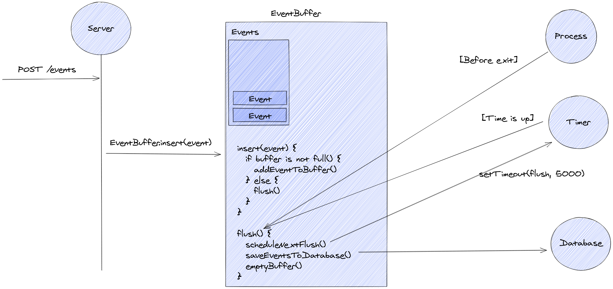

**Start the server**

```console
docker-compose up -d
yarn
yarn start
```

**Make a request**

```console
POST http://localhost:7070/events

{
	"name": "foo",
	"view": "bar",
	"payload": {
		"hello": "world"
	}
}
```


